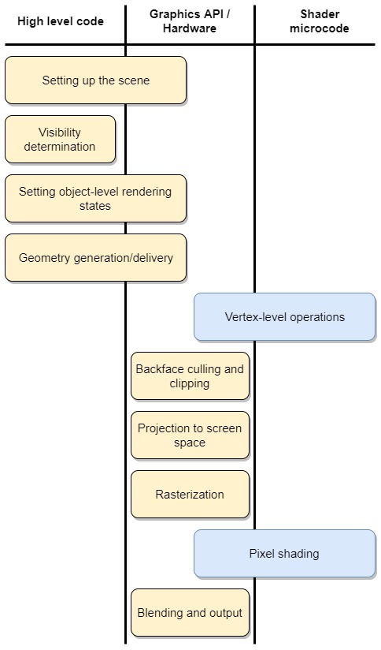

# Lightening Talk: WebGL

## What is WebGL?

Web Graphics Library - is a JavaScript API for rendering interactive 2D and 3D graphics within any compatible web browser without the use of plug-ins. WebGL is fully integrated with other web standards, allowing GPU-accelerated usage of physics and image processing and effects as part of the web page canvas. 

WebGL programs consist of control code written in JavaScript and shader code that is written in OpenGL ES Shading Language (GLSL ES), a language similar to C or C++, and is executed on a computer's graphics processing unit (GPU). WebGL is designed and maintained by the non-profit Khronos Group.

## History 
WebGL evolved out of the Canvas 3D experiments started by Vladimir Vukićević at Mozilla. (Then: Director of Engineering a Mozilla) He now is working at Unity Labs. (A WebGL framework) He demonstrated the first protype of 3D rendering on to the Canvas element in 2006.

Development of the WebGL 2 specification started in 2013 and was finalized in January 2017. 

Browsers that first implemented via the specification: 
Firefox 51 (Jan 2017), Chrome 56, and Opera 43.

Every major browser currently supports WebGL (minus Opera Mini)
https://caniuse.com/#search=webGL

## What is it used for? 

At Equinox WebGL is used to render the Grip test in **Digital Equifit** as well as the visualizations in **The Pursuit** app. 

## Why use it? 

1. Performance. WebGL is blazingly fast and fully utilizes hardware acceleration with the GPU, making it suitable for games or complex visualizations. Although other options can benefit from hardware acceleration, WebGL is written with performance in mind and will out perform other options for years to come. 

2. Shaders. WebGL applications can utilize mini programs known as “shaders” to produce complex visual effects. (Examples covered below)

## Shaders (Very High level)

Shaders are validated by the browser and are converted into bytecode to be ran on the GPU. A shader program runs very fast and in parallel on many pixels at one time.

1. Vertex Shader - basically calculates coorinates
2. Fragment Shader - calculates the color for the current pixel being rendered

### WebGL Render Pipeline:

Ideally you want your code to pass through this pipeline in 16 milliseconds or less: allowing your frame to refresh at a rate 60fps. Why 60 fps? (Film runs 24 fps) Most screens have a refresh rate of 60Hz. 1Hz = 1 cycle per second.

[Here is was 24fps looks like in comparison to 60fps on screen:](https://www.youtube.com/watch?v=WyvUIA7KUjc)

### > ShaderToy Examples: 
[Driving in the Rain](https://www.shadertoy.com/view/MdfBRX) 
[Protean clouds](https://www.shadertoy.com/view/3l23Rh) 
[Clouds](https://www.shadertoy.com/view/XslGRr) 
[Elevated Mountains](https://www.shadertoy.com/view/MdX3Rr) 
[Rhodium Liquid Carbon](https://www.shadertoy.com/view/llK3Dy) 

## Developing directly with Shaders & WebGL

> If you’re a graphics genius with a PHD in Mathematics, this is definitely the way to go. For most of us mere mortals, I don’t recommend it.

> Using pure WebGL is the equivalent of learning and programming directly in assembly language, when you could be using a language like C++ to make your life easier.

If all the shader/GLSL code above is daunting: don't fret there are still ways to build captivating experiences with WebGL.

## Frameworks 

WebGL frameworks abstract away a lot of the difficult parts of WebGL. (The differences between a using the WebGL api directly will be shown below.) 

### <b>[Three.js](https://threejs.org/)</b> (used in Digital Equifit)

The most widly used framework for coding webGL.

First released in April of 2010 by Ricardo Cabello (Mr. Doob). Was originally developed in ActionScript, which is where I first learned about the libary. I was using Papervision in 2005.  😬😬😬

Some great examples of three.js in the wild: 
[Particles](https://particle-love.com/) 
[Video & Transitions](http://taotajima.jp/) 
[Stars & Scaling](http://stars.chromeexperiments.com/)

### <b>[Unity](https://unity.com/)</b>

### <b>[Babylon.js](https://www.babylonjs.com/)</b>

For an exhaustive list of webGL frameworks visit: 
[https://en.wikipedia.org/wiki/List_of_WebGL_frameworks](https://en.wikipedia.org/wiki/List_of_WebGL_frameworks)

Resource used here re: frameworks 
[https://hackernoon.com/five-ways-to-build-webgl-apps-4c7eb541d193](https://hackernoon.com/five-ways-to-build-webgl-apps-4c7eb541d193)

### > Code Examples

Directly interacting with the WebGL api:  
[https://codepen.io/arock/pen/NZdjBp?&editable=true&editors=101](https://codepen.io/arock/pen/NZdjBp?&editable=true&editors=101<) 
[https://www.shadertoy.com/view/Ms2SD1](https://www.shadertoy.com/view/Ms2SD1)

w/ Framework:  
[https://codepen.io/arock/pen/qzRjWe?editors=0010](https://codepen.io/arock/pen/qzRjWe?editors=0010) (Edit) 
[https://codepen.io/arock/pen/GbrmPo?editors=0010](https://codepen.io/arock/pen/GbrmPo?editors=0010)

### Postprocessing

One of the most interesting things to me with WebGL is postprocessing. Where the GPU used to effect the whole screen after it has been rasterised at the very end of the render pipeline. (See render pipeline above)

Post processing generally refers to applying some kind of effect or filter to a 2D image. In the case of THREE.js we have a scene with a bunch of meshes in it. We render that scene into a 2D image. Normally that image is rendered directly into the canvas and displayed in the browser but instead we can render it to a render target and then apply some post processing effects to the result before drawing it to the canvas. It's called post processing because it happens after (post) the main scene processing.

Post processing are like Instagram filters, Photoshop filters, etc... except they run on every frame of an animation. And a great example of post processing is when you are playing a first person shooter and your health is going down and the screen gets blury or scratchy: 

**[FPS lens scratches](https://vanruesc.github.io/postprocessing/public/demo/#texture)** 

**[Depth Of Field](https://threejs.org/examples/#webgl_postprocessing_dof2)** 

**[Bloom Filter](https://threejs.org/examples/#webgl_postprocessing_unreal_bloom_selective )**
 
**[Bloom + Full example list](https://vanruesc.github.io/postprocessing/public/demo/#bloom )**

**Thank you!**  
[https://codepen.io/arock/pen/mZRwMW?editors=0010](https://codepen.io/arock/pen/mZRwMW?editors=0010)

Other Interesting Links:  
[https://experiments.withgoogle.com/search?q=WebGL](https://experiments.withgoogle.com/search?q=WebGL) 
[https://artsexperiments.withgoogle.com/freefall/random#739.65,-658.32,3424.45](https://artsexperiments.withgoogle.com/freefall/random#739.65,-658.32,3424.45) 

More Resource: 
[https://webglfundamentals.org/](https://webglfundamentals.org/) 
[https://www.khronos.org/assets/uploads/developers/library/2015-gtc/NVIDIA-Shaders-WebGL-Meetup-GTC_Mar15.pdf](https://www.khronos.org/assets/uploads/developers/library/2015-gtc/NVIDIA-Shaders-WebGL-Meetup-GTC_Mar15.pdf)

WebGL Tools:  
[https://webglstudio.org/](https://webglstudio.org/) 
[https://site.vizor.io/](https://site.vizor.io/) 
[https://developer.mozilla.org/en-US/docs/Tools/Shader_Editor](https://developer.mozilla.org/en-US/docs/Tools/Shader_Editor) 

